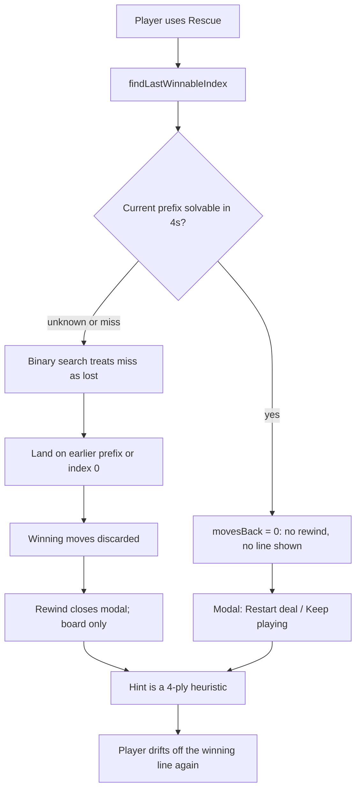
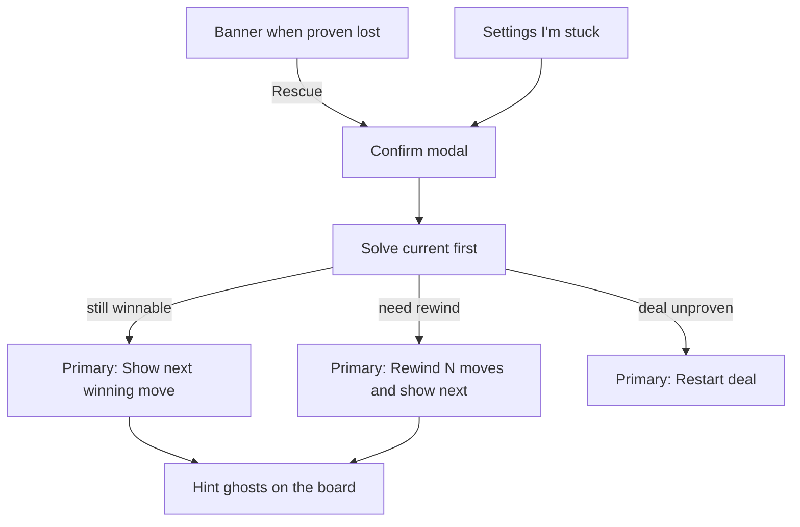

# Fix Rescue so it can actually get you a win

Rescue is not a play-out-the-win button. It is a **rewind to the last prefix the in-browser solver can prove**, and then you are on your own. The in-play popup (bottom banner, then a blocking modal with **Rewind** / **Restart deal**) is how that shows up — and it does not hand you a winning move. That is why using Rescue still often does not win the game.

## What is going wrong

**1. The solver finds a win and throws it away (highest impact)**

[`findLastWinnableIndex`](src/solver/rescue.ts) already calls `solveDeal` + `replayWins`. On success it keeps only `{ index, checked }`. [`findRescue`](src/state/gameStore.ts) never stores `found.moves`. After rewind, **Hint** uses [`rankedHints`](src/solver/search.ts) (120ms, depth 4, shuffles/build-breaks dropped). That is not the rescue line, so you can be walked back into a lost position.

This is explicit in [`seedPool.ts`](src/solver/seedPool.ts): shipped seeds omit solutions because they only work from move 0; mid-game rescue is supposed to search from the live log — and then it still does not use the line it found.

**2. The in-play Rewind / Restart popup does not actually unstick you**

Two UIs, both in scope:

- **Banner** ([`RescueBanner.tsx`](src/components/chrome/RescueBanner.tsx)): non-blocking toast when the watcher proves `lost`. Undo + Rescue. Copy talks about rewind. Stays as the entry point (not auto-opening the modal).
- **Modal** ([`RescuePanel.tsx`](src/components/panels/RescuePanel.tsx)): blocking dialog from banner **Rescue** or Settings **I'm stuck**. Always leads with _"This deal is winnable — the position on the board is not."_ Footer is **Rewind N moves** (only if `movesBack > 0`), **Restart deal**, **Keep playing**.

What is wrong with that popup today:

- Confirming Rewind **closes the dialog and leaves you on the board with no next move**. You popped a modal to get help and got a position change.
- If the solver still sees a win (`movesBack === 0`), Rewind is hidden and the remaining primary-looking action is **Restart deal** — a trap on a still-winnable board.
- Lead copy is a lie in the `movesBack === 0` branch, and on unverified deals.
- It claims undone moves stay redoable; one Redo restores the killing line.

**3. The common "I'm stuck" case is a no-op**

Human-stuck is not solver-lost. The panel says _"Already at the last winnable position"_ and hides Rewind. No winning move is shown.

**4. Rescue often waits ~log2(n)×4s only to say that**

Binary search always walks prefixes even when the _current_ position is fine. Each probe uses the RESCUE profile (700k nodes / 4s). A 40-move still-winnable game can sit on "Searching…" for ~20s, then offer Restart / Keep playing.

**5. Unknown is treated as lost, so 4-suit games rewind too far (often to 0)**

A miss is "could not find a win in 4s", not a proof of defeat. Index 0 is **never re-proven** — assumed winnable because it "came from the pool". False for `winnableOnly` off, shared `?seed=` URLs, and empty-pool `randomSeed()`. The modal still says the deal is winnable and offers Restart.

**6. After rewind, Redo restores the killing line**

[`rewindTo`](src/state/gameStore.ts) prepends discarded moves onto `redoLog`.

**7. Watcher skip after any foundation collect (banner never appears)**

[`winnabilityWatcher.ts`](src/state/winnabilityWatcher.ts) keys only on `moveLog.length`. Collecting publishes twice: `collecting: true` skips the check but **records the key**; `collecting: false` sees the same key and never checks. Dead boards after a set-collect never raise the banner unless you Undo or open **I'm stuck**. Fixing this makes the banner appear when it _should_, not randomly more often. Still never warn on `unknown`.

**8. Miner contends for the same long-job worker**

[`mine`](src/state/miner.ts), winnability, and last-winnable share one worker.

## Recommended product behavior

Keep the **confirm modal** (do not one-click rewind from the banner). Do **not** auto-play the whole game. After Rescue, **Hint follows the proven continuation** until you deviate.

When Rescue runs:

1. **Solve the current position first** (one RESCUE search).
2. If a line replays to a win: `movesBack = 0`, keep `continuation`. Modal primary CTA: **Show next winning move**. Do not push Restart.
3. If not: search earlier prefixes; keep that continuation.
4. On **Rewind**: apply it, **clear redo**, store the continuation, **close the modal, and immediately play the first continuation move as a hint** (same ghosts as Hint). One confirm both restores a winnable board and shows what to do.
5. Later **Hint** presses keep following `continuation[0]` while the player stays on the line. A deviation clears it.
6. If even index 0 cannot be proven: honest copy; Restart is appropriate here.

## Implementation

### A. Solver: return the line, check now first

[`src/solver/rescue.ts`](src/solver/rescue.ts)

- Return `{ index, checked, continuation: readonly Move[] }`.
- Probe **`moveLog.length` first**. If `solved && replayWins`, return immediately.
- Only then binary-search `1 .. n-1`. Keep `found.moves` for the best index.
- If `best === 0`, **actually solve the deal**. If it fails, return `continuation: []`.

[`src/solver/worker.ts`](src/solver/worker.ts) / [`src/solver/client.ts`](src/solver/client.ts): thread the new field through `lastWinnable`.

### B. Store the line and prefer it for Hint

[`src/state/uiStore.ts`](src/state/uiStore.ts) (or `gameStore`): `rescueContinuation: Move[] | null`.

[`src/state/gameStore.ts`](src/state/gameStore.ts)

- `findRescue`: save `continuation`.
- Rescue `rewindTo`: **do not** copy discarded moves onto `redoLog`; after rewind, start hint playback of `continuation[0]`.
- `attemptMove`: if the move equals `continuation[0]`, shift; else clear.
- `undo` / `newGame` / `restartDeal`: clear.
- `requestHint`: if `continuation[0]` is still legal, skip the worker and play it via `explainMove` with `confidence: 'high'`.

### C. In-play popup: banner stays, modal actually helps

**Banner** ([`RescueBanner.tsx`](src/components/chrome/RescueBanner.tsx)): unchanged flow. Still only on proven `lost`. Undo + Rescue still open the modal. Optional copy tweak: Rescue "finds the last winnable position and shows the next move" rather than only "rewind".

**Modal** ([`RescuePanel.tsx`](src/components/panels/RescuePanel.tsx)), after search:

- **Still winnable** (`movesBack === 0`, continuation non-empty): lead _"This position can still be won."_ Primary **Show next winning move** (starts hint, closes panel). **Keep playing**. Hide or demote **Restart deal** (ghost, not the thing you click by habit).
- **Need rewind** (`movesBack > 0`, continuation non-empty): lead how far back. Primary **Rewind N moves** — on click, rewind, clear redo, close, show next winning move. **Restart deal** and **Keep playing** stay secondary.
- **Cannot prove a win** (empty continuation): lead _"Could not prove a win from this deal."_ Primary **Restart deal**. No fake Rewind.
- While searching: spinner; do not present Rewind/Restart as if a plan already exists.

### D. Watcher: do not record the key until the board has settled

[`src/state/winnabilityWatcher.ts`](src/state/winnabilityWatcher.ts)

If `collecting`, cancel in-flight work and **return without updating `lastKey`**. When the sweep publishes `collecting: false`, the new key is seen and the check runs.

### E. Pause the miner around Rescue / winnability

[`src/state/miner.ts`](src/state/miner.ts): `pauseSeedMiner` / `resumeSeedMiner`. Call pause before `winnability` / `lastWinnable`, resume in `finally`.

## Tests (must cover the real failure modes)

- [`src/solver/rescue.test.ts`](src/solver/rescue.test.ts): current-first returns `index === log.length` and a non-empty continuation on a pooled 1-suit prefix; index 0 is actually solved when every later prefix misses; unverified seed can return empty continuation.
- [`src/state/winnabilityWatcher.test.ts`](src/state/winnabilityWatcher.test.ts): after the collect animation, a check **is** scheduled.
- Rewind tests: Rescue rewind does not populate redo; Hint prefers `continuation[0]`; a side move clears the line.
- [`src/components/panels/RescuePanel.test.tsx`](src/components/panels/RescuePanel.test.tsx):
  - `movesBack === 0` with a continuation: **Show next winning move**, not Rewind; Restart is not the primary button.
  - `movesBack > 0`: Rewind click closes the panel **and** starts hint playback of the continuation's first move.
  - Empty continuation: honest copy, Restart primary, no Rewind.

## Out of scope

- Shipping full solutions in the seed pool.
- Auto-playing the entire continuation.
- Skipping the confirm modal (one-click rewind from the banner).
- Raising the banner on `unknown`.
- Turning Rescue prune to `none`.
