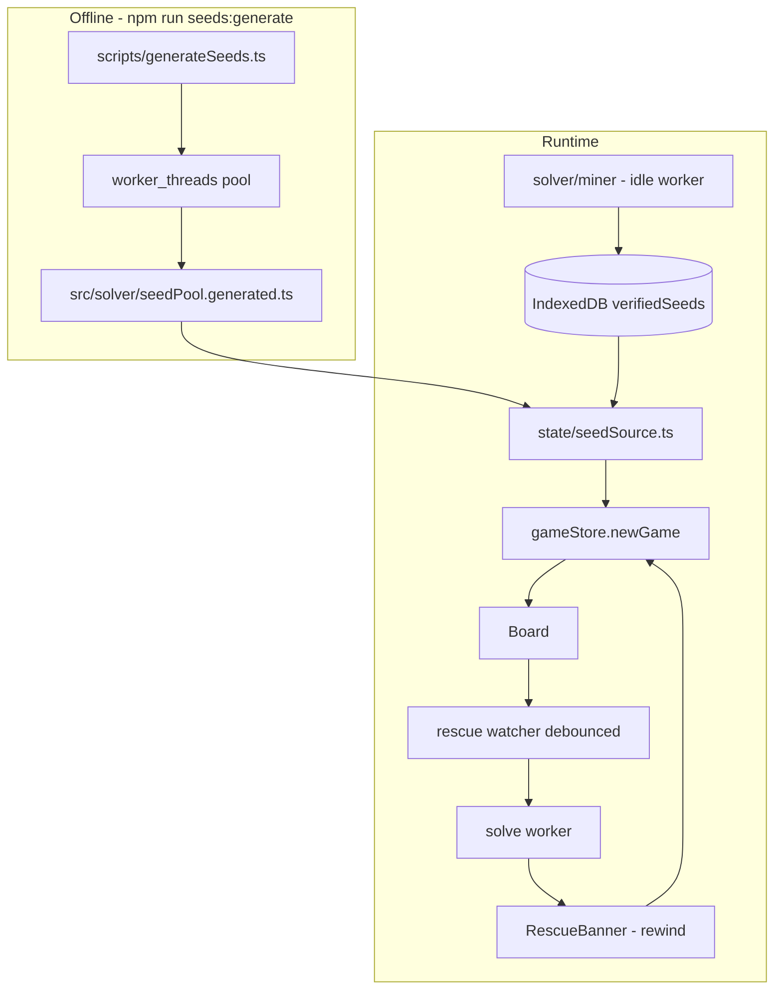

-# Guaranteed Winnable Deals for 2- and 4-Suit

## What exists today

Nothing in the app guarantees winnability.

- `newGame` in [src/state/gameStore.ts](src/state/gameStore.ts) (lines 187-203) calls `randomSeed()` — a raw `Math.random()` — and deals it. The solver is never consulted.
- `findWinnable` in [src/solver/worker.ts](src/solver/worker.ts) (lines 84-118) is a complete, correct implementation that is **never called by anything**. `SolverClient.findWinnable` in [src/solver/client.ts](src/solver/client.ts) (lines 82-87) returns `Promise<unknown>`, unlike its typed siblings — a tell that it was written speculatively.
- `'verifiedSeeds'` appears exactly once in the repo, as an unused member of the `PersistKey` union in [src/state/persist.ts](src/state/persist.ts) (line 12).
- No `winnableOnly` setting, no searching UI, no difficulty rating.

**And the solver could not do the job even if wired up.** `search` in [src/solver/search.ts](src/solver/search.ts) is a greedy best-first that permanently discards its frontier:

```103:107:src/solver/search.ts
    // Bound open list to avoid memory blowups
    if (open.length > 2_000) {
      open.sort((a, b) => b.score - a.score)
      open.length = 2_000
    }
```

Because discarded nodes are unrecoverable, the `unsolvable` return at line 111 is unsound. Pruning is limited to `reverses()` (line 31); the good `hintableMoves` ladder in [src/engine/game.ts](src/engine/game.ts) (lines 318-345) is used only for hints, never for `search`. Nodes hold full `GameState` objects keyed by ~200-character strings from [src/solver/canonical.ts](src/solver/canonical.ts), and `orderMoves` calls `applyMove` on every child, then `search` calls it again. `findWinnable` gives each candidate 5,000 nodes / 400ms, which will essentially never crack a fresh 4-suit deal.

## The key insight that makes this safe

**The guarantee does not depend on solver strength.** We only ever ship a seed after a solution has been found _and replayed through the real engine to `isWon`_. A weaker solver means a smaller pool, never a broken promise. That decouples the risk: Phase 1 is measured, and if it underperforms we ship fewer seeds rather than unverified ones.

Second: a winnable deal is only half the problem. Most 4-suit deals become unwinnable within a few bad moves, so "never stuck" also needs the mid-game rescue in Phase 5.

## Architecture



## Phase 1 — Rewrite the full-game solver (highest risk, do first)

Replace `search` in [src/solver/search.ts](src/solver/search.ts) with `solveDeal`, in a new `src/solver/solve.ts` so the well-tested hint path (`hintSearch`, `rankedHints`) is untouched.

- **Compact state.** New `src/solver/compact.ts`: encode a `GameState` as a flat `Uint8Array` (card byte = `suit*13 + rank`, high bit = faceUp) plus column offsets and a stock cursor, with `toCompact`/`fromCompact` adapters and an in-place `applyCompactMove`. This is what makes holding a million nodes and hashing them cheap, and it removes the double `applyMove` per child.
- **Real Zobrist.** Fix [src/solver/zobrist.ts](src/solver/zobrist.ts), which is currently unused and aliases badly: index the table by `(cardByte, column, positionInColumn)` with no modulo collapse, fold in stock depth and foundation count, and maintain it incrementally. Transposition table becomes a `Set` of numeric keys instead of long strings.
- **Frontier with no truncation.** Binary heap ordered by `heuristic - depthWeight * depth`. Memory is bounded by the node budget, not by throwing away candidates, so an exhausted frontier now genuinely means `unsolvable`.
- **Pruning** (the largest cheap win, all of it already exists in the engine and is simply not applied to the solver): drop `shuffle` and `breakBuild` tiers via `classifyMove`; collapse all empty-column destinations for the same run into one; auto-apply set-completing moves as forced single steps; keep the existing `reverses` check.
- **Profiles** in one exported object: `VERIFY` (offline, `maxNodes: 4_000_000`, `maxMs: 60_000`), `MINE` (background, 2s slices), `RESCUE` (mid-game, 4s).
- Keep `search`'s public signature as a thin deprecated wrapper so [src/solver/search.test.ts](src/solver/search.test.ts) and the worker keep compiling during the transition.

**Gate:** a new `scripts/bench.ts` (`npm run solver:bench`) reports solve rate, median nodes and median wall time over 100 random seeds per difficulty. Target: 4-suit solve rate at or above 90% within 30s per deal. Report the number before proceeding — it directly sets how big the shipped pool can be.

## Phase 2 — Offline seed generation

- `scripts/generateSeeds.ts`, run with `npx vite-node` (already available via vitest, and it resolves the `@/` alias), fanning out over `node:worker_threads` sized to `os.availableParallelism()`.
- **Verify under the strictest ruleset:** `{ allowDealWithEmptyColumn: false }`. `DEFAULT_GAME_SETTINGS` in [src/engine/types.ts](src/engine/types.ts) has it `true`, and `canDealStock` (rules.ts line 72) is more permissive in that mode — so a solution found under the strict rule stays legal under the permissive one, and the seed is winnable whichever way the player has the toggle set.
- Every accepted seed must replay through the real `applyMove` to `isWon`, exactly as the current `findWinnable` already does at worker.ts lines 100-107. Never relax this.
- Emits `src/solver/seedPool.generated.ts`: `{ version, generatedAt, pools: Record<Difficulty, { seed: number; nodes: number }[]> }`. Target 200 seeds for 1-suit, 600 each for 2- and 4-suit. Seeds and node counts only — no move lines — so the whole asset is roughly 10KB gzipped and can stay in the main bundle.
- `nodes` maps to a 1-5 star difficulty rating by quantile within its difficulty band.
- Scripts: `seeds:generate`, `seeds:verify` (re-checks the committed pool end to end, for CI/pre-release).

## Phase 3 — Runtime seed source

- New `src/state/seedSource.ts` with `nextVerifiedSeed(difficulty): VerifiedSeed | null` (synchronous fast path) and `primeSeedSource()` to hydrate from IndexedDB at boot.
- Selection order: locally mined seeds from the `verifiedSeeds` IDB key, then unused bundled seeds, then reset the used-set and reuse the bundled pool. Used-seed set persisted under `verifiedSeeds` alongside the mined list; the key already exists in `PersistKey` and just needs read/write helpers in [src/state/persist.ts](src/state/persist.ts).
- **New games stay instant.** The bundled pool is a static import, so `newGame` remains synchronous in the normal case. The shimmer path only exists for the genuinely empty-pool fallback.
- `winnableOnly: boolean` (default `true`) added to `SettingsState` in [src/state/settingsStore.ts](src/state/settingsStore.ts) with a switch in `SettingsPanel.tsx`, sitting alongside the existing four toggles.
- `newGame` in [src/state/gameStore.ts](src/state/gameStore.ts) takes the seed from `nextVerifiedSeed` when `winnableOnly` is on, falling back to `randomSeed()` when off or exhausted. Store `verified: boolean` and `stars: 1..5` on the game handle so the UI can show a "Verified winnable" badge — the trust signal matters as much as the guarantee, since a hard-but-winnable 4-suit deal still feels impossible.

## Phase 4 — Background mining and worker fixes

Two worker bugs block this and must be fixed first:

- **Cancellation is unreachable.** `self.onmessage` at worker.ts line 124 is fully synchronous, so a `cancel` message cannot be delivered while a solve occupies the event loop, and the guard at line 56 only checks at request entry. Also `SolverClient.call` (client.ts line 55) generates the id internally and never returns it, so no caller can name a request to cancel.
- **The solve worker's `settings` is dropped** — worker.ts line 67 calls `search(state, budget)` with no settings, silently using `DEFAULT_GAME_SETTINGS`.

Fix by splitting responsibilities: keep the existing shared worker for short `hint` calls, and give long jobs (mine, rescue) their own dedicated worker instance where cancellation is simply `terminate()`. Change `call` to return `{ id, promise }`. This also guarantees a hint press never queues behind a multi-second search.

Then `src/solver/miner.ts`: on `requestIdleCallback` after boot, mine seeds for the current difficulty in 2s slices, write to `verifiedSeeds` (capped at 200 per difficulty), pause on `visibilitychange` hidden and while a game is actively being played, and stop when the cap is reached.

## Phase 5 — The mid-game safety net

New `src/solver/rescue.ts` plus a watcher in `gameStore`.

- After each committed move, debounce ~600ms and ask the solve worker whether the current position is still winnable. Three-valued: `winnable | lost | unknown`. Surfaced as `winnability` in [src/state/uiStore.ts](src/state/uiStore.ts).
- **Only warn on a definite `lost`** — a genuinely exhausted frontier, which is now trustworthy given Phase 1. Never warn on `unknown`, or the feature cries wolf on every hard position and players stop believing it.
- On `winnable` → `lost`, show a dismissible non-modal toast: "That move made this deal unwinnable" with an inline Undo.
- **"I'm stuck" button** → `findLastWinnableIndex(seed, difficulty, moveLog)`: walk the move log backwards (binary search over prefixes, using `fold`) for the last winnable position. Index 0 is guaranteed winnable because the seed came from the verified pool, so this always terminates with an answer. Streams progress to a panel, then offers "Rewind N moves".
- `rewindTo(index)` added to `gameStore`: truncate `moveLog` to `index`, push the tail onto `redoLog` so the player can still step forward, and refold. Reuses the existing `commit`/`publish` path so animations and scoring stay correct.
- Hard dead end (`isDeadEnd`, already in rules.ts line 82) gets the same panel with restart as an extra option.

## Phase 6 — Tests and docs

- Pool integrity: for a sampled subset in CI and the full pool under `seeds:verify`, every shipped seed must solve and replay to `isWon` under strict settings. This is the test that backs the promise.
- `solveDeal` returns `unsolvable` only on an exhausted frontier — regression test on a constructed dead board, replacing the current `expect(['unsolvable','unknown']).toContain(...)` at search.test.ts line 74 which asserts almost nothing.
- Real 2-suit and 4-suit solves from `createGame`, which the suite has never had. The existing "solves a near-win foundation fixture" is a one-move 1-suit puzzle.
- Zobrist: no collisions across a 200k-state random playout; incremental hash equals the from-scratch hash at every step.
- `findLastWinnableIndex` returns 0 when the first move kills a verified deal.
- Worker RPC: cancellation actually aborts, with a mocked worker.
- `gameStore`: `newGame` with `winnableOnly` on always draws from the pool; `rewindTo` round-trips against `fold`.
- E2E: a 4-suit game shows the verified badge; a scripted deal-killing move raises the warning; rescue rewinds and the board matches.
- Update `docs/rules.md` and the Phase 6 section of the plan doc to reflect that a precomputed pool is now in scope — it is currently listed under "Explicitly OUT of scope" at line 52, which this supersedes.

## Notes on things deliberately not done

- No winning move-lines are shipped. They would multiply the asset size by roughly 100x, and they solve from move 0 only — useless once the player has diverged, which is exactly when help is needed. Phase 5's rewind covers that case properly.
- `canonicalKey`'s doc comment claims suit-symmetry folding for 1- and 2-suit games that is not implemented. Phase 1 either implements it in the compact representation or corrects the comment.
