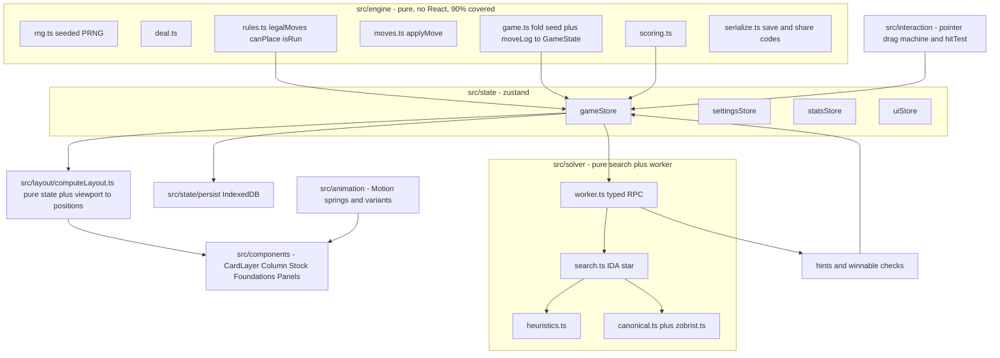

# Ultra-Modern Web Spider Solitaire — Implementation Plan

## Locked decisions

- Stack: React 19 + TypeScript (strict) + Vite + Zustand. DOM/CSS cards animated with Motion (Framer Motion successor).
- 100% client-side installable PWA. Persistence in IndexedDB. No server, no accounts.
- Visual direction: dark glassmorphism + neon accents, with several neon-family themes.
- Features in scope: core play (1/2/4-suit, drag + tap-to-move, unlimited undo/redo, auto-complete, valid-move highlighting), assists (ranked hints, no-moves detection, dead-end warning, restart/replay same deal), guaranteed-winnable deals verified **on demand** in a worker with a loading shimmer, seed sharing, stats dashboard, achievements, daily challenge, theming, audio + haptics, scoring/timer/move counter, replay viewer.
- Solver: real IDA*/best-first search with transposition table, running in a Web Worker.
- Motion: `prefers-reduced-motion` fully honored with a tuned low-motion variant. Mouse + touch only.
- Delivery: 10 phases, each gated on typecheck + lint + tests passing.

## Explicitly OUT of scope (do not build)

Full keyboard card navigation, screen-reader move announcements, i18n/RTL, interactive tutorial, backend/cloud sync/leaderboards, Storybook, GitHub Actions CI, build-time precomputed winnable-seed pool. A small set of laptop convenience shortcuts (undo/redo/hint/deal/new/mute/escape) IS in scope — that is not keyboard play.

## Architecture



### The three load-bearing ideas

1. **State = `{ seed, difficulty, moveLog }`.** Everything else is derived by folding the log. This gives undo/redo, replay, tiny save files, seed sharing, and perfectly deterministic tests for free. Memoize the fold with a snapshot cache every 25 moves; refolding 300 moves over 104 cards is sub-millisecond.
2. **Layout is a pure function.** `computeLayout(state, viewport, settings) -> Map<CardId, CardPlacement>`. One absolutely-positioned card layer; cards are never re-parented. Every animation is a transform interpolation between two layout maps. Makes visuals unit-testable and GPU-cheap.
3. **Drag never touches React state.** Pointer deltas write to Motion values / refs on a portal'd drag layer. React re-renders only on commit. This is what keeps 60fps on a mid-range tablet.

### Core types (write these first, in `src/engine/types.ts`)

```ts
export type Suit = 'S' | 'H' | 'D' | 'C'
export type Rank = 1 | 2 | 3 | 4 | 5 | 6 | 7 | 8 | 9 | 10 | 11 | 12 | 13 // 1=A, 13=K
export type CardId = string & { readonly __brand: 'CardId' } // `${Suit}${Rank}#${copy}`
export interface Card {
  readonly id: CardId
  readonly suit: Suit
  readonly rank: Rank
  readonly faceUp: boolean
}
export type Difficulty = 1 | 2 | 4
export type ColumnIndex = 0 | 1 | 2 | 3 | 4 | 5 | 6 | 7 | 8 | 9

export type Move =
  | {
      readonly kind: 'moveRun'
      readonly from: ColumnIndex
      readonly to: ColumnIndex
      readonly count: number
    }
  | { readonly kind: 'dealStock' }

export interface GameState {
  readonly difficulty: Difficulty
  readonly columns: readonly (readonly Card[])[] // length 10
  readonly stock: readonly (readonly Card[])[] // remaining deals, each length 10
  readonly foundations: readonly (readonly Card[])[] // completed K..A runs
  readonly moveCount: number
  readonly score: number
}

export type MoveResult =
  | { readonly ok: true; readonly state: GameState; readonly effects: readonly Effect[] }
  | { readonly ok: false; readonly reason: IllegalMoveReason }
```

Auto-flip of a newly exposed card and auto-removal of a completed K→A run are **deterministic consequences** of a move, emitted as `Effect[]` for the animation layer — they are never separate log entries. That keeps the log canonical (2 bytes per move) and replay exact.

### Canonical rules (write `docs/rules.md` first; tests cite it)

- 104 cards. 1-suit = 8×A–K spades; 2-suit = 4×A–K of S and H; 4-suit = 2×A–K of each suit.
- Deal 54: columns 0–3 get 6 cards, columns 4–9 get 5. Only the last card of each column is face up. Stock = 5 deals of 10.
- A movable group is a same-suit strictly-descending run of face-up cards ending at the column tail. It may be placed on a card of rank+1 of **any** suit, or onto an empty column.
- Stock deal is blocked while any column is empty (setting `allowDealWithEmptyColumn`, default off).
- A complete same-suit K→A run in a column is auto-removed to a foundation. Win = 8 foundations.
- Scoring — Standard: start 500, −1 per move, −1 per undo (setting `undoPenalty`, default on), +100 per foundation. Vegas: bankroll persisted across games, −$500 buy-in per deal, +$100 per foundation, +$50 time bonus tiers; documented as a house rule so it is testable.
- Timer accrues only while the tab is visible and the game is not paused.

## Phase plan

Each phase ends with: `npm run typecheck && npm run lint && npm run test -- --coverage` green, plus the phase's own gate. Do not start the next phase until the gate passes. Commit per phase with a conventional-commit message.

### Phase 0 — Scaffold and tooling

- `npm create vite@latest . -- --template react-ts`, then install latest versions (never invent version numbers): `zustand`, `motion`, `idb-keyval`, `clsx`; dev: `vitest`, `@vitest/coverage-v8`, `jsdom`, `@testing-library/react`, `@testing-library/user-event`, `@testing-library/jest-dom`, `fake-indexeddb`, `fast-check`, `@playwright/test`, `eslint`, `typescript-eslint`, `eslint-plugin-react-hooks`, `eslint-plugin-import`, `prettier`, `vite-plugin-pwa`, `husky`, `lint-staged`.
- `tsconfig`: `strict`, `noUncheckedIndexedAccess`, `exactOptionalPropertyTypes`, `noImplicitOverride`, `noFallthroughCasesInSwitch`, `verbatimModuleSyntax`, `erasableSyntaxOnly`. Path alias `@/*`.
- ESLint flat config: `typescript-eslint` strict-type-checked + stylistic, react-hooks. Add an **import boundary rule** (`import/no-restricted-paths`) enforcing: `engine` imports nothing from `react|components|state|solver`; `solver` imports only `engine`; `components` never import `solver/worker` directly.
- Vitest projects: `engine` + `solver` (node env), `ui` (jsdom env, setup file with jest-dom + `matchMedia` mock). Coverage thresholds: `src/engine/**` and `src/solver/**` at 80% for lines/branches/functions/statements; global 90%.
- Scripts: `dev`, `build`, `preview`, `typecheck`, `lint`, `format`, `test`, `test:watch`, `test:ui`, `e2e`, `e2e:update-snapshots`, `check` (runs typecheck+lint+test+e2e).
- Husky pre-commit → lint-staged (eslint --fix, prettier) + `tsc --noEmit`.
- Create the full folder skeleton, `README.md`, `docs/rules.md`, `docs/testing.md`, `docs/animation.md`, `docs/adr/0001-seed-plus-movelog.md`.
- Gate: `npm run check` passes on an empty-but-wired project.

### Phase 1 — Engine core (the most important phase)

Files: `engine/{types,cards,rng,deal,rules,moves,game,invariants}.ts` and `engine/testing/ascii.ts`.

- `rng.ts`: `mulberry32(seed)` + `shuffle(array, rng)` Fisher-Yates. Pin behavior with a golden vector test — this must never change or shared seeds break.
- `rules.ts`: `isRun(cards)`, `movableRunLength(column)`, `canPlace(run, destColumn)`, `legalMoves(state): Move[]`, `canDealStock(state)`, `isWon(state)`, `isDeadEnd(state)`.
- `moves.ts`: `applyMove(state, move): MoveResult` returning `Effect[]` (`{kind:'flip'|'foundation'|'moved'}`).
- `game.ts`: `createGame(seed, difficulty)`, `fold(seed, difficulty, moveLog)` with snapshot cache, `undo`, `redo`, selectors (`hintableMoves`, `autoCompletableRuns`, `remainingDeals`).
- `invariants.ts`: `assertInvariants(state)` — 104-card multiset conservation, no face-down above face-up, every non-empty column tail is face-up, foundations only hold complete runs, stock length ∈ {0,10,20,30,40,50}.
- **ASCII fixture DSL** — the single biggest testing-quality lever:

```
difficulty: 1
c0: [2] SK SQ SJ
c1: [0] S5
c2: -            # empty column
stock: 20
found: 3
```

`parseBoard(ascii): GameState` fills face-down slots deterministically from the unused pool; `printBoard(state)` gives readable diffs. Use everywhere instead of hand-built object literals.

- Tests: deck composition per difficulty; deal shape and face-down count (44); RNG golden vector; **exhaustive** `canPlace` over all 13×13×4×4 rank/suit combinations; `isRun` truth tables; legal-move generation on ~15 ASCII fixtures; deal blocked with empty column; auto-flip; foundation auto-removal (including the 8th → win); dead-end detection; undo/redo including undo-across-a-foundation-removal.
- Property tests (fast-check): card conservation over random 200-move playouts; `applyMove` accepts exactly the moves `legalMoves` returns and rejects everything else; `fold` is deterministic; move-then-undo is state-identical; invariants never break; no throw on any random playout.
- Gate: `src/engine/**` at 90% coverage.

### Phase 2 — Scoring, persistence, share codes

- `scoring.ts`: both modes, pure, injected `Clock` port (never call `Date.now()` directly anywhere outside `platform/clock.ts`).
- `serialize.ts`: `SaveV1` schema with `version` field + `MIGRATIONS: Record<number, (old) => next>`; encode move log as a compact string (`from,to,count` packed into one base64url char pair; `dealStock` as `.`); `encodeShareCode({seed,difficulty})` → readable Crockford-base32 with a checksum, `decodeShareCode` returns a Result and rejects corrupt input.
- `state/persist.ts`: idb-keyval store, keys `settings | currentGame | stats | achievements | daily | replays`; debounced 400ms autosave plus flush on `visibilitychange`/`pagehide`; `replays` capped at the last 20 (each is just seed + log, a few hundred bytes).
- Tests: round-trip save/load, every migration path, share-code round-trip + checksum rejection + fuzz over random garbage, persistence against `fake-indexeddb`, debounce with fake timers, cap eviction.

### Phase 3 — Layout engine and static rendering

- `layout/constants.ts`: card aspect 2.5/3.5; face-down overlap `0.10h`, face-up `0.28h`, compression floors `0.055h`/`0.13h`.
- `layout/computeLayout.ts` (pure): fit **all 10 columns without horizontal scroll at every viewport** (horizontal scroll would wreck dragging). Column width = `(W − 2·padX − 9·gap)/10`, clamped to a max. Per column, if stack height exceeds available height, shrink offsets proportionally toward the floor, then switch that column to "rank-strip" mode where only the rank corner shows. Returns `{x, y, z, rotate, scale, faceUp, compressed}` per `CardId`. Handles safe-area insets and `dvh`.
- Components (static, no animation yet): `CardLayer` (single absolutely positioned layer, `React.memo`'d `Card`), `Card` with custom SVG faces (rank glyph + suit path set; two face styles: modern-minimal and high-contrast large-index for tablets) and 4 SVG card backs, `ColumnDropZones` (invisible rects), `Stock` with remaining-deals indicator, `Foundations` (8 slots), `TopBar` (score, moves, timer, deals left, undo/redo/hint buttons), `Menu`, `SettingsPanel`, glass `Panel` primitive.
- `theme/tokens.css` + `theme/themes.ts`: CSS custom properties per `:root[data-theme]` for felt gradient, card face/back, glow color, radii, shadow layers, spring params. Neon-family themes: Midnight Neon (cyan/magenta), Aurora (violet/green), Ember (amber/red), Mono Glass.
- Global CSS hygiene: `touch-action: none` on the board, `overscroll-behavior: none`, `user-select: none`, `-webkit-touch-callout: none`, `-webkit-tap-highlight-color: transparent`, `viewport-fit=cover`, no context menu on the board.
- Tests: `computeLayout` snapshots for 1024×768, 1366×1024, 768×1024 (portrait), 1280×800, 1920×1080; property test that no card lands outside bounds and columns never overlap horizontally for random states × random viewports; compression kicks in exactly at the threshold; RTL tests for `Card` (face vs back), `TopBar` counters, `SettingsPanel` writes to store, theme switch flips `data-theme`.
- Add a non-blocking "rotate for a better view" hint in portrait on narrow tablets.

### Phase 4 — Animation system

- `animation/springs.ts`: named presets — `snap` (stiffness 520, damping 32, 3% overshoot), `deal`, `flip`, `panel`, `celebrate`. All read from theme tokens.
- `animation/motionPreset.ts`: `useMotionPreset()` returns the full preset or the **low-motion** preset when `prefers-reduced-motion: reduce` or the user setting is on — low-motion = 80ms opacity/position fades, no arcs, no particles, no shimmer, no idle attract. Every animation reads from this; no component hardcodes durations.
- Animation catalogue to implement (also document in `docs/animation.md`):
  1. Initial deal — cards arc out of the stock, 18ms stagger, per-card rotation, spring settle, flip on arrival.
  2. Card flip — 3D `rotateY` with two faces + `backface-visibility`, shadow contracts mid-flip, 220ms.
  3. Drag pickup — scale 1.06, shadow lift, velocity-based tilt, z raise.
  4. Multi-card ribbon — dragged run follows with 12ms per-card stagger so it reads as a flexible ribbon.
  5. Drop snap — spring with slight overshoot + landing ripple.
  6. Invalid drop — 6px shake, red rim light, spring back to origin, 180ms.
  7. Stock deal — a 10-card wave fanning out with per-column stagger; stock visibly thins.
  8. Foundation completion — the K→A run pulses gold, collapses into one stack, arcs to its foundation slot with a motion trail, foundation badge counts up, bloom flash.
  9. Auto-complete — rhythmic 60ms cadence chain with rising audio pitch.
  10. Hint — breathing glow on source, animated dashed path to destination, pulsing destination ring.
  11. Win celebration — foundation fountain of cards + CSS particles, confetti burst, backdrop bloom, animated score count-up, trophy panel spring-in.
  12. Undo — reverse motion with time-warp easing so it reads as a rewind, not a new move.
  13. Chrome — panels spring+blur in, buttons depress with ripple, tab indicator morphs via `layoutId`, animated number counters.
  14. Idle attract — after 20s idle, a shimmer sweeps across currently movable runs.
  15. Theme switch — `clip-path` circular reveal originating at the toggle.
- Performance rules (enforce in review): animate only `transform`/`opacity`; `will-change` only during an active drag; never animate `width/height/top/left`; single rAF loop for drag; no full-board re-render per pointermove.
- Tests: with `matchMedia` mocked to `reduce`, components render the low-motion variant and moves commit within one tick; deal orchestration emits the expected stagger sequence (test the pure orchestrator function, not the pixels); `Effect[]` → animation-queue mapping is unit-tested.

### Phase 5 — Interaction (touch + mouse)

- `interaction/dragMachine.ts` — a **pure** state machine (`idle → pressed → dragging → (dropping | cancelling)`) taking normalized pointer events and returning commands. Fully unit-testable, zero DOM.
- `interaction/usePointerDrag.ts` — Pointer Events only (`pointerdown/move/up/cancel`), `setPointerCapture`, no separate mouse/touch paths.
- Tuning that matters:
  - Drag threshold 4px mouse / 8px touch; below threshold and <250ms → tap.
  - Touch lift: on `pointerType === 'touch'`, offset the dragged stack ~24px above the finger so it isn't hidden; 0 for mouse.
  - Drop targeting via `hitTest.ts`: nearest column by horizontal distance to cached column rects (from `ResizeObserver`), with tolerance — **not** strict overlap, and never `elementFromPoint`.
  - Tap-to-move: tap a movable run → auto-move ranked (same-suit build > any legal build > empty column, preferring the move that exposes a face-down card); double-click does the same on desktop; a setting offers tap-select-then-tap-destination instead.
  - Long-press 500ms on a compressed card → temporary magnified peek of that column.
  - Hover (mouse only): lift + neon glow on the movable run, cursor `grab`/`grabbing`/`not-allowed`.
  - Laptop shortcuts: `Ctrl/Cmd+Z` undo, `Ctrl/Cmd+Shift+Z` redo, `H` hint, `Space`/`D` deal, `N` new game, `M` mute, `Esc` close panel.
- Wire `gameStore` actions: `newGame`, `attemptMove`, `tapMove`, `dealStock`, `undo`, `redo`, `autoComplete`, `restartDeal`, `requestHint`.
- Tests: `dragMachine` exhaustively (thresholds, cancel, pointer loss, tap-vs-drag with fake timers); `hitTest` math; RTL + `user-event` tests for pointer drag on the board and for tap-to-move; store action tests.
- First Playwright specs: deal renders 54 cards; a mouse drag performs a legal move; an illegal drag springs back; tap-to-move works with `page.touchscreen`.

### Phase 6 — Solver, hints, winnable deals

- `solver/canonical.ts`: canonical state key — columns are unordered, so sort column signatures before hashing; suit-symmetry folding for 1- and 2-suit games. `zobrist.ts` for incremental 64-bit (BigInt or two 32-bit halves) hashing.
- `solver/heuristics.ts`: score = `w1·foundations − w2·faceDownCount − w3·buriedBlockers + w4·orderedRunLength + w5·emptyColumns`. Weights in one exported object with a comment explaining each.
- `solver/search.ts`: iterative-deepening / best-first hybrid with a transposition table, move ordering by heuristic delta, and pruning (never immediately reverse the previous move; forbid pointless empty-column shuffling; forbid breaking an already-correct same-suit parent unless it frees a face-down card). Budgets: `maxNodes`, `maxMs`, cooperative `shouldAbort()`. Returns `{status: 'solved', moves} | {status: 'unsolvable'} | {status: 'unknown', bestLine}`.
- `solver/worker.ts` + `solver/client.ts`: hand-rolled ~40-line typed RPC (`{id, method, params}` / `{id, result}`) with promise correlation, cancellation by id, and worker `terminate()` on hard abort. No new dependency.
- Hints: bounded search from the current state; return the top 3 moves each with a human explanation ("frees a hidden card", "builds a same-suit run", "opens a column") and a confidence badge; expose "hints used" so achievements can check it.
- Winnable-only deals (on demand, as chosen): on new game with the toggle on, the worker loops generate-seed → solve within a per-difficulty budget (1-suit 400ms, 2-suit 1.2s, 4-suit 2.5s) until solvable. UI shows the "shuffling the deck" shimmer with an attempt counter, an elapsed indicator, and a "Deal anyway" escape hatch after 5s. Every verified seed is cached in IndexedDB (`verifiedSeeds`) so later games can be instant, and solver node count feeds a 1–5 star **difficulty rating** badge shown on the deal.
- Dead-end / stuck detection surfaced in the UI: hard dead end (no legal moves, no stock) → offer undo or restart; soft stuck (only non-progressing moves remain, detected against the visited-state set for this game) → a dismissible warning.
- Tests: solves a curated set of known-solvable ASCII fixtures within budget; reports `unsolvable` on a constructed dead board; **every solver solution is replayed through the real engine and must reach a won state** (this is the key correctness test, also as a fast-check property over random winnable seeds); canonical key is identical for column permutations and differs for genuinely different states; abort/cancel works; hint ordering is deterministic; worker RPC correlation and cancellation tested with a mocked worker.

### Phase 7 — Meta features

- `features/stats`: games/wins per difficulty, win %, current and longest streak, best and average time/moves/score, total foundations, distribution histograms, last-20 sparkline. Hand-rolled SVG charts (no chart library) so they are snapshot-testable. Pure `computeStats(results)` reducer.
- `features/achievements`: ~20 achievements, each a **pure predicate** `(result, stats, history) => boolean` in one registry array — trivially unit-testable. Examples: first win; win each difficulty; 4-suit win with zero hints; win with zero undos; sub-4-minute 1-suit win; win under 120 moves; 7-day daily streak; 5 wins in a row; win using at most 2 stock deals; win after a dead-end warning. Unlock toast with spring + shine sweep, and an achievements gallery with locked/unlocked states.
- `features/daily`: `seedForDate(dateISO, difficulty)` via a stable string hash; calendar heatmap of completions; first-attempt result recorded separately from retries; streak tracking; share card rendered to PNG on a `<canvas>` (`toBlob`) with `navigator.share` and clipboard/download fallbacks.
- `features/replay`: because state is seed + log, replay is just an index over the log. Controls: play/pause, 0.5×/1×/2×/4×, step forward/back, scrubber with markers at foundation completions. Reuses the exact same layout + animation pipeline in read-only mode.
- Restart-this-deal and "share this deal" (share code in the URL, `?seed=...&d=4`, hydrated on load).
- Tests: `computeStats` on fixture result sets; every achievement predicate true-and-false case; `seedForDate` determinism and difficulty separation; replay index reaches the same state as the full fold at every step (property test); share-card canvas invoked with expected values (mock `toBlob`).

### Phase 8 — Audio, haptics, polish

- `audio/AudioEngine.ts`: one `AudioContext` created lazily and unlocked on the first `pointerdown`; preloaded `AudioBuffer`s; per-play `AudioBufferSourceNode` with ±3% random detune and small gain jitter so repeats never sound machine-gunned; channel gain nodes (master/sfx/music); ambient loop with crossfade; ducking under the win fanfare; suspend on `visibilitychange`; all settings persisted; a `NullAudioEngine` used in tests and when muted.
- Sound set: card slide, card place, flip, invalid buzz, stock deal whoosh, foundation chime (pitch rises with foundation count), auto-complete arpeggio, win fanfare, achievement sparkle, UI tick.
- Haptics: `navigator.vibrate` short pulses on pickup/valid drop/invalid, feature-detected (note iOS Safari does not support it), off by default with a setting.
- Remaining polish animations from the Phase 4 catalogue (celebration, auto-complete, idle attract, theme wipe) and empty-state/first-run visuals.
- Tests: `AudioEngine` against a stubbed WebAudio API (buffer created, gain per channel, detune applied, muted path plays nothing, context suspended on hide); haptics feature detection both ways.

### Phase 9 — PWA, performance, full test matrix, docs

- `vite-plugin-pwa` with an autoUpdate service worker, precache of all assets, offline fallback, manifest (name, theme color matching the active theme, maskable icons at 192/512, `display: standalone`, `orientation: any`), and an in-app "update available" toast.
- Performance pass: verify only transform/opacity animate; profile a 30-second drag session and confirm no dropped frames on a throttled CPU (4× throttle in DevTools/Playwright CDP); confirm no full-board re-render per pointermove using a render-count probe in a test; target < 200KB gzip initial JS with the solver worker and panels lazily chunked; `React.lazy` for Stats/Achievements/Replay/Settings panels.
- Playwright projects: Desktop Chrome, Desktop Firefox, Desktop WebKit, `iPad (gen 7)` landscape and portrait, `Galaxy Tab S4` — the tablet projects with `hasTouch: true`.
- E2E flows: deterministic setup via `?seed=&d=&moves=` plus a test-only `window.__spider` bridge exposed when `import.meta.env.MODE === 'test'`; mouse drag; touch drag; tap-to-move; invalid spring-back; stock deal; undo/redo; complete one foundation from a scripted fixture and assert the animation and counters; win from a near-win fixture and assert celebration + stats + achievement; reload mid-game restores exactly; offline reload works after the service worker installs; `emulateMedia({ reducedMotion: 'reduce' })` completes moves instantly; portrait rotate hint appears.
- Visual regression: `toHaveScreenshot` on frozen states (`?test=1` disables springs) across all themes × 3 viewports, with a masked timer region.
- Docs: `README.md` (quick start, scripts, architecture diagram, decisions), `docs/rules.md`, `docs/animation.md`, `docs/testing.md`, ADRs.
- Final gate: `npm run check` fully green; engine and solver at 90% coverage; global ≥ 90%; Lighthouse (run locally) PWA installable, Performance ≥ 95 on desktop.

## Suggestions I folded in (and a few for later)

Folded in: difficulty star rating from solver effort; verified-seed caching so the on-demand winnable search gets faster over time; "Deal anyway" escape hatch so the shimmer can never trap the user; touch-lift offset and nearest-column tolerant drop targeting (the two things that most often make tablet solitaire feel bad); long-press peek for compressed columns; hints-used and undos-used tracked so achievements can reward clean play; the ASCII board DSL, which will make the test suite readable instead of a wall of object literals; a `NullAudioEngine` and injected `Clock` so nothing in tests depends on real time or sound.

Worth considering later, deliberately not in this plan: a "practice this deal" mode that lets you branch from any replay position; an on-idle demo mode where the solver plays itself as an attract screen; cloud sync behind the persistence interface; full keyboard play and screen-reader announcements; GitHub Actions CI with the E2E matrix and a bundle-size gate (currently local-only via `npm run check`).
